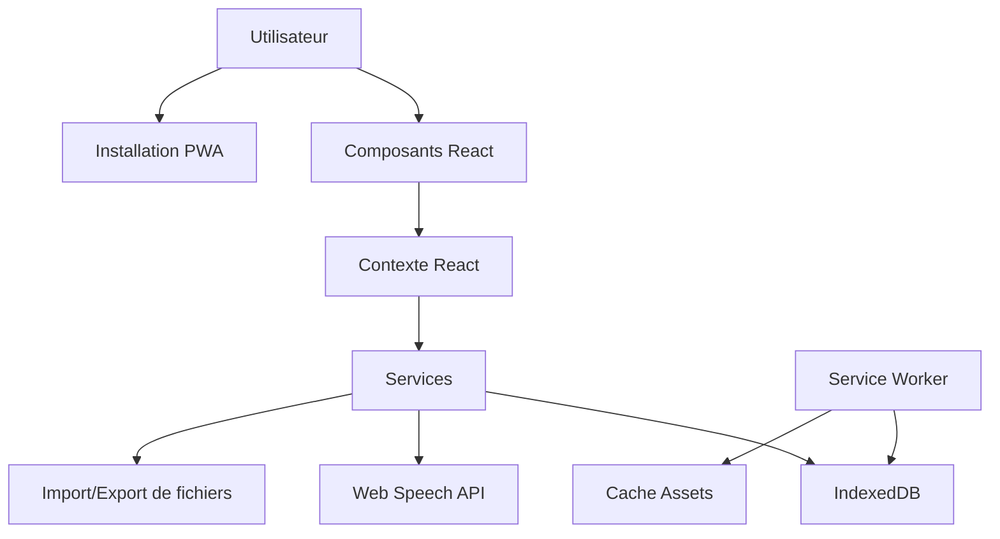

# Guide technique - Dictée Markdown

Ce document présente l'architecture technique du projet et explique comment étendre ou modifier l'application.

## Table des matières

-   [Architecture](#architecture)
-   [Structure du projet](#structure-du-projet)
-   [Modèle de données](#modèle-de-données)
-   [Composants clés](#composants-clés)
-   [Services](#services)
-   [PWA et fonctionnalités hors ligne](#pwa-et-fonctionnalités-hors-ligne)
-   [Syntaxe Markdown](#syntaxe-markdown)
-   [Moteur de synthèse vocale](#moteur-de-synthèse-vocale)
-   [Migration depuis l'ancien format](#migration-depuis-lancien-format)
-   [Tests](#tests)
-   [Déploiement](#déploiement)

## Architecture

Dictée Markdown est une application React construite avec Vite, utilisant une architecture basée sur les composants et services. Voici un aperçu des principales technologies :

-   **React** : Bibliothèque UI pour les composants d'interface
-   **Vite** : Outil de build moderne et rapide
-   **Tailwind CSS** : Utilitaire CSS pour le styling
-   **IndexedDB** : Stockage persistant côté client
-   **Web Speech API** : Synthèse vocale native
-   **Service Worker** : Cache et fonctionnalités hors ligne
-   **Marked.js** : Analyse et rendu du Markdown



## Structure du projet

```
dictee-markdown/
├── public/                  # Fichiers statiques
│   ├── manifest.json        # Manifeste PWA
│   ├── sw.js                # Service Worker
│   └── icons/               # Icônes pour PWA
├── src/
│   ├── components/          # Composants React
│   │   ├── Editor/          # Éditeur de dictée
│   │   ├── Player/          # Lecteur de dictée
│   │   ├── Migration/       # Migration ancien format
│   │   └── common/          # Composants partagés
│   ├── services/            # Services
│   │   ├── markdown.js      # Gestion du Markdown
│   │   ├── storage.js       # Accès à IndexedDB
│   │   ├── tts.js           # Synthèse vocale
│   │   └── migration.js     # Migration des données
│   ├── contexts/            # Contextes React
│   │   └── DicteeContext.js # Contexte global
│   ├── hooks/               # Hooks personnalisés
│   ├── utils/               # Fonctions utilitaires
│   ├── App.jsx              # Composant racine
│   └── main.jsx             # Point d'entrée
├── docs/                    # Documentation
├── tests/                   # Tests
├── vite.config.js           # Configuration Vite
├── tailwind.config.js       # Configuration Tailwind
└── package.json             # Dépendances
```

## Modèle de données

### Structure d'une dictée

Les dictées sont stockées en interne avec cette structure :

```typescript
interface Dictee {
    id: string; // Identifiant unique (UUID)
    title: string; // Titre de la dictée
    sentences: string[]; // Tableau des phrases
    language: string; // Code de langue (ex: 'fr-FR')
    createdAt: number; // Timestamp de création
    updatedAt: number; // Timestamp de dernière modification
    isRandom: boolean; // Si l'ordre des phrases est aléatoire
}
```

Dans IndexedDB, nous utilisons un object store `dictees` pour stocker ces objets.

## Composants clés

### DicteeEditor

Composant d'édition de dictée avec :

-   Mode visuel (WYSIWYG)
-   Mode Markdown direct
-   Prévisualisation
-   Numérotation automatique

### DicteePlayer

Composant de lecture de dictée avec :

-   Synthèse vocale intégrée
-   Mise en surbrillance du texte lu
-   Feedback sur les réponses
-   Statistiques de performance

### MigrationTool

Outil de conversion des anciennes dictées :

-   Analyse des paramètres d'URL
-   Conversion des codes ASCII
-   Génération du Markdown

## Services

### MarkdownService

```javascript
// src/services/markdown.js

// Convertit une dictée en Markdown
export function dicteeToMarkdown(dictee) {
    let markdown = `# ${dictee.title}\n\n`;

    dictee.sentences.forEach((sentence, index) => {
        markdown += `${index + 1}. ${sentence}\n`;
    });

    return markdown;
}

// Analyse un Markdown pour extraire une dictée
export function markdownToDictee(markdown) {
    const lines = markdown.split("\n");
    let title = "";
    const sentences = [];

    // Cherche le titre (ligne commençant par #)
    const titleMatch = lines.find((line) => /^#\s+(.+)$/.test(line));
    if (titleMatch) {
        title = titleMatch.replace(/^#\s+/, "");
    }

    // Cherche les phrases numérotées
    lines.forEach((line) => {
        const sentenceMatch = line.match(/^\d+\.\s+(.+)$/);
        if (sentenceMatch) {
            sentences.push(sentenceMatch[1]);
        }
    });

    return {
        id: crypto.randomUUID(),
        title: title || "Sans titre",
        sentences,
        language: "fr-FR",
        createdAt: Date.now(),
        updatedAt: Date.now(),
        isRandom: false,
    };
}
```

### StorageService

Interface avec IndexedDB pour la persistance des données :

```javascript
// src/services/storage.js

const DB_NAME = "dictee-markdown-db";
const DB_VERSION = 1;
const DICTEE_STORE = "dictees";

// Initialise la base de données
export async function initDB() {
    return new Promise((resolve, reject) => {
        const request = indexedDB.open(DB_NAME, DB_VERSION);

        request.onerror = () =>
            reject(new Error("Erreur d'ouverture de la base de données"));

        request.onupgradeneeded = (event) => {
            const db = event.target.result;
            if (!db.objectStoreNames.contains(DICTEE_STORE)) {
                db.createObjectStore(DICTEE_STORE, { keyPath: "id" });
            }
        };

        request.onsuccess = (event) => resolve(event.target.result);
    });
}

// Sauvegarde une dictée
export async function saveDictee(dictee) {
    const db = await initDB();
    return new Promise((resolve, reject) => {
        const transaction = db.transaction([DICTEE_STORE], "readwrite");
        const store = transaction.objectStore(DICTEE_STORE);

        dictee.updatedAt = Date.now();
        const request = store.put(dictee);

        request.onerror = () =>
            reject(new Error("Erreur lors de la sauvegarde"));
        request.onsuccess = () => resolve(dictee);
    });
}

// Récupère toutes les dictées
export async function getAllDictees() {
    const db = await initDB();
    return new Promise((resolve, reject) => {
        const transaction = db.transaction([DICTEE_STORE], "readonly");
        const store = transaction.objectStore(DICTEE_STORE);
        const request = store.getAll();

        request.onerror = () =>
            reject(new Error("Erreur lors de la récupération des dictées"));
        request.onsuccess = () => resolve(request.result);
    });
}

// Autres fonctions CRUD...
```

### TTSService

Interface avec Web Speech API pour la synthèse vocale :

```javascript
// src/services/tts.js

// Vérifie la disponibilité de la synthèse vocale
export function isTTSSupported() {
    return "speechSynthesis" in window;
}

// Récupère les voix disponibles pour une langue
export function getVoices(lang) {
    return new Promise((resolve) => {
        const synth = window.speechSynthesis;

        // Si les voix sont déjà chargées
        let voices = synth.getVoices();
        if (voices.length > 0) {
            resolve(filterVoicesByLang(voices, lang));
            return;
        }

        // Sinon, attendre le chargement des voix
        synth.onvoiceschanged = () => {
            voices = synth.getVoices();
            resolve(filterVoicesByLang(voices, lang));
        };
    });
}

// Filtre les voix par langue
function filterVoicesByLang(voices, lang) {
    if (!lang) return voices;

    // Recherche exacte puis partielle
    const exactMatch = voices.filter((voice) => voice.lang === lang);
    if (exactMatch.length > 0) return exactMatch;

    // Recherche par code de langue (2 premiers caractères)
    const langPrefix = lang.slice(0, 2);
    return voices.filter((voice) => voice.lang.startsWith(langPrefix));
}

// Lit le texte avec la synthèse vocale
export function speak(text, options = {}) {
    if (!isTTSSupported()) return null;

    const synth = window.speechSynthesis;
    const utterance = new SpeechSynthesisUtterance(text);

    // Applique les options
    if (options.voice) utterance.voice = options.voice;
    if (options.rate) utterance.rate = options.rate;
    if (options.pitch) utterance.pitch = options.pitch;
    if (options.volume) utterance.volume = options.volume;

    // Gestion des événements
    if (options.onStart) utterance.onstart = options.onStart;
    if (options.onEnd) utterance.onend = options.onEnd;
    if (options.onError) utterance.onerror = options.onError;

    // Arrête toute synthèse en cours
    synth.cancel();

    // Démarre la lecture
    synth.speak(utterance);

    return utterance;
}
```

## PWA et fonctionnalités hors ligne

### Service Worker

Configuration du Service Worker pour la mise en cache et le fonctionnement hors ligne :

```javascript
// public/sw.js

const CACHE_NAME = "dictee-markdown-cache-v1";
const ASSETS = [
    "/",
    "/index.html",
    "/assets/index.js",
    "/assets/index.css",
    // Autres ressources...
];

// Installation du Service Worker
self.addEventListener("install", (event) => {
    event.waitUntil(
        caches
            .open(CACHE_NAME)
            .then((cache) => cache.addAll(ASSETS))
            .then(() => self.skipWaiting())
    );
});

// Activation du Service Worker
self.addEventListener("activate", (event) => {
    event.waitUntil(
        caches
            .keys()
            .then((cacheNames) => {
                return Promise.all(
                    cacheNames
                        .filter((name) => name !== CACHE_NAME)
                        .map((name) => caches.delete(name))
                );
            })
            .then(() => self.clients.claim())
    );
});

// Stratégie de cache : network first, fallback to cache
self.addEventListener("fetch", (event) => {
    event.respondWith(
        fetch(event.request)
            .then((response) => {
                // Mise en cache de la réponse
                const responseClone = response.clone();
                caches
                    .open(CACHE_NAME)
                    .then((cache) => cache.put(event.request, responseClone));
                return response;
            })
            .catch(() => caches.match(event.request))
    );
});
```

### Manifest.json

Configuration du manifeste PWA pour l'installation :

```json
{
    "name": "Dictée Markdown",
    "short_name": "Dictée",
    "description": "Application de dictée avec format Markdown",
    "start_url": "/index.html",
    "display": "standalone",
    "background_color": "#ffffff",
    "theme_color": "#4f46e5",
    "icons": [
        {
            "src": "/icons/icon-72x72.png",
            "sizes": "72x72",
            "type": "image/png"
        },
        // Autres tailles d'icônes...
        {
            "src": "/icons/icon-512x512.png",
            "sizes": "512x512",
            "type": "image/png"
        }
    ]
}
```

## Migration depuis l'ancien format

Le service de migration convertit les anciennes URLs en format Markdown :

```javascript
// src/services/migration.js

// Convertit une ancienne URL en objet dictée
export function convertOldUrlToDictee(url) {
    const params = new URLSearchParams(url.split("?")[1]);

    // Récupération du titre
    const title = params.get("titre") || "Sans titre";

    // Récupération de la langue
    const language = params.get("tl") || "fr";

    // Lecture des phrases encodées
    const sentences = [];

    for (let i = 1; i <= 20; i++) {
        const encodedPhrase = params.get(`d[${i}]`);
        if (encodedPhrase) {
            const decodedPhrase = decodeOldPhrase(encodedPhrase);
            if (decodedPhrase) {
                sentences.push(decodedPhrase);
            }
        }
    }

    // Création de l'objet dictée
    return {
        id: crypto.randomUUID(),
        title: decodeURIComponent(title),
        sentences,
        language: mapLanguageCode(language),
        createdAt: Date.now(),
        updatedAt: Date.now(),
        isRandom: params.get("a") === "1",
    };
}

// Décode une phrase encodée dans l'ancien format
function decodeOldPhrase(encodedPhrase) {
    try {
        const codes = encodedPhrase.split("|");
        return codes
            .filter((code) => code !== "")
            .map((code) => String.fromCharCode(parseInt(code, 10)))
            .join("");
    } catch (error) {
        console.error("Erreur de décodage:", error);
        return "";
    }
}

// Convertit les codes de langue anciens vers les nouveaux
function mapLanguageCode(oldCode) {
    const mapping = {
        fr: "fr-FR",
        en: "en-US",
        es: "es-ES",
        de: "de-DE",
        it: "it-IT",
    };

    return mapping[oldCode] || "fr-FR";
}
```

## Tests

Le projet utilise Vitest pour les tests unitaires et end-to-end :

```javascript
// tests/markdown.test.js
import { describe, it, expect } from "vitest";
import { dicteeToMarkdown, markdownToDictee } from "../src/services/markdown";

describe("MarkdownService", () => {
    it("should convert dictee to markdown", () => {
        const dictee = {
            title: "Test Dictée",
            sentences: ["Phrase 1", "Phrase 2"],
        };

        const markdown = dicteeToMarkdown(dictee);
        expect(markdown).toContain("# Test Dictée");
        expect(markdown).toContain("1. Phrase 1");
        expect(markdown).toContain("2. Phrase 2");
    });

    it("should convert markdown to dictee", () => {
        const markdown = `# Test Dictée\n\n1. Phrase 1\n2. Phrase 2`;

        const dictee = markdownToDictee(markdown);
        expect(dictee.title).toBe("Test Dictée");
        expect(dictee.sentences).toHaveLength(2);
        expect(dictee.sentences[0]).toBe("Phrase 1");
        expect(dictee.sentences[1]).toBe("Phrase 2");
    });
});
```

## Déploiement

Le projet peut être déployé sur n'importe quel service d'hébergement statique :

```bash
# Construction pour la production
npm run build

# Le résultat se trouve dans le dossier dist/
```

Pour un déploiement optimal :

-   Assurez-vous que les en-têtes HTTPS sont correctement configurés
-   Configurez les règles de cache pour les fichiers statiques
-   Vérifiez que le Service Worker est bien servi depuis la racine du domaine
